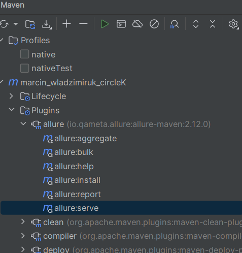
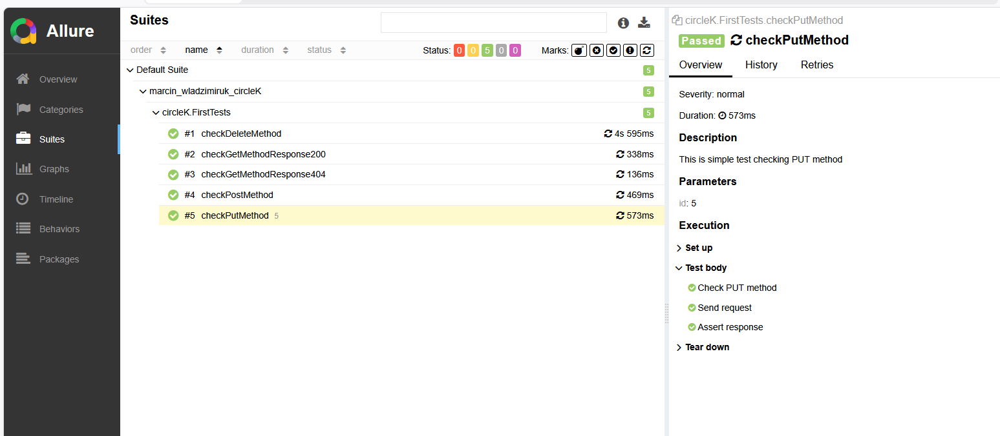
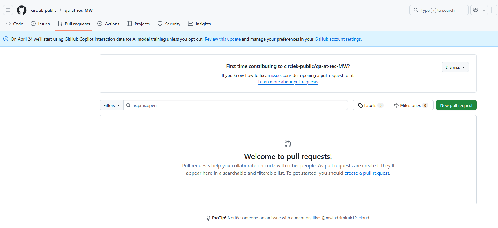

After run test you can generate report using allure serve:

and then u will see your report!

We use spotless to get better code

I got  message:
Review task:
On our repository (GitHub - circlek-public/qa-at-rec-MW ) is “pull request”. We need a code review.

BUT: I can not see any pull request :(

